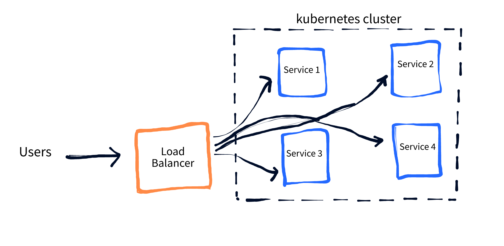

[](https://github.com/unsupervisedlearner1123/ml-chat-app/actions/workflows/docker-image.yml)

# Flask Chatbot with OpenAI

**Developers:** Deekshita Saikia, Jaya Khan, Satvik Kishore

This project is a Flask application that uses SpeechRecognizer and OpenAI APIs to create a voice chatbot. The chatbot can respond to user input in natural language and is designed to be scalable using Azure Kubernetes Service (AKS) and load testing with Locust.

## High Level Architecture of ChatBot application


## Deployment Architecture of ChatBot application




## Requirements

* Python 3.6 or higher
* OpenAI API key
* Docker
* Kubernetes command-line tool (kubectl)
* Azure command-line tool (Azure CLI) 

## Getting Started

To run the chatbot on your local machine, follow these steps:

1. Clone the repository:

```
git clone https://github.com/YOUR_USERNAME/YOUR_REPO.git
cd YOUR_REPO
```

2. Create a virtual environment and activate it:

```
python -m venv venv
source venv/bin/activate
```

3. Install the required dependencies:

```
pip install -r requirements.txt
```

4. Set up your OpenAI API credentials as the environment variable:

```
export OPENAI_API_KEY=YOUR_API_KEY
```

Replace YOUR_API_KEY with your OpenAI API key.

5. Run the app locally:

```
export FLASK_APP=app.py
flask run
```

The app will be available at http://localhost:80/.

## Deployment

To deploy the chatbot to an AKS cluster, follow these steps:

1. Build the Docker image:

```
docker build -t YOUR_IMAGE_NAME .
```

Replace YOUR_IMAGE_NAME with a name for your Docker image.

2. Push the Docker image to a registry:

```
docker tag YOUR_IMAGE_NAME YOUR_REGISTRY_URL/YOUR_IMAGE_NAME
docker push YOUR_REGISTRY_URL/YOUR_IMAGE_NAME
```

Replace YOUR_REGISTRY_URL with the URL of your Docker registry.

3. Create an AKS cluster in your Azure account.

4. Deploy the app to AKS:

```
kubectl apply -f azdeploy.yaml
```

5. Access the app:

```
kubectl get service chatapp-front2 --watch
```

This will return the IP address where the service is deployed to. Use this to access the app in your web browser.

## Load Testing

To test the scalability of the chatbot, we use Locust, an open-source load testing tool. Follow these steps to run a load test:

1. Install Locust:

```
pip install locust
```

2. Run Locust:

```
locust --host=http://<external-ip-address>
```

Replace <external-ip-address> with the IP address that the service is running at.

3. Access the Locust web interface in your browser:

```
http://localhost:8089/
```

Here, you can start the load test and see the results.

## Contributing

Contributions are welcome. Please open a pull request and we will respond at the earliest.
